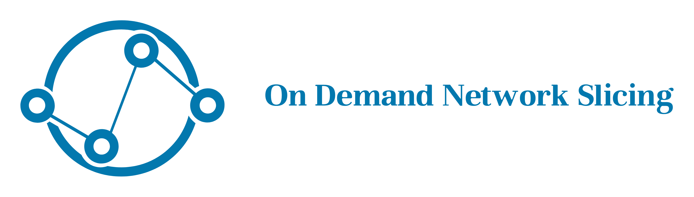

<a name="readme-top"></a>

<!-- PROJECT LOGO -->
<br />
<div align="center">
  <a href="https://github.com/chaudhry0/networking_II_dynamic_sclicing/">
    
  </a>

<h3 align="center">On Demand SDN Slices in ComNetsEmu</h3>

  <p align="center">
    powered by Unitn students
    <br />
    <a href="https://github.com/github_username/repo_name"><strong>Explore the documents »</strong></a>
    <br />
    <br />
    <a href="https://github.com/github_username/repo_name">View video Demo</a>
    ·
    <a href="https://github.com/github_username/repo_name/issues">Report Bug</a>
    ·
    <a href="https://github.com/github_username/repo_name/issues">Request Feature</a>
  </p>
</div>


<!-- TABLE OF CONTENTS -->
<details>
  <summary>Table of Contents</summary>
  <ol>
    <li>
      <a href="#about-the-project">About The Project</a>
      <ul>
        <li><a href="#built-with">Built With</a></li>
      </ul>
    </li>
    <li>
      <a href="#getting-started">Getting Started</a>
      <ul>
        <li><a href="#prerequisites">Prerequisites</a></li>
        <li><a href="#installation">Installation</a></li>
      </ul>
    </li>
    <li><a href="#usage">Usage</a></li>
    <li><a href="#roadmap">Roadmap</a></li>
    <li><a href="#contact">Contact</a></li>
    <li><a href="#acknowledgments">Acknowledgments</a></li>
  </ol>
</details>

<!-- ABOUT THE PROJECT -->
## About The Project

[![GUI image][GUI]](https://github.com/chaudhry0/networking_II_dynamic_sclicing/GUI.jpg)

On Demand SDN Slices in ComNetsEmu is a project aimed at implementing a network slicing approach that allows for dynamic activation and de-activation of network slices via command line interface (CLI) or graphical user interface (GUI) commands. The goal of this project is to provide a flexible and efficient way to manage network resources in a virtualized environment.

With the increasing demand for various types of network services, network slicing has emerged as a promising solution to address this challenge. Network slicing allows multiple virtual networks to co-exist on the same physical infrastructure, each with its own characteristics and requirements. The On Demand SDN Slices in ComNetsEmu project implements this concept using software-defined networking (SDN) technology.

The project uses a single SDN controller, such as RYU, to manage the network slices. The user can activate and de-activate different slices on demand, depending on their specific requirements. The slices can be described using templates, which allow for easy identification of flows, topology, and link capacity for each slice.

Overall, On Demand SDN Slices in ComNetsEmu provides a powerful and versatile solution for managing network resources in a virtualized environment. With its ability to activate and de-activate slices on demand, it offers increased flexibility and efficiency for users.

<p align="right">(<a href="#readme-top">back to top</a>)</p>

### Built With
* [![Python][Python-logo]][Python-url]
* [![Visual Studio Code][VSC-logo]][VSC-url]
* [![MININET]][Mininet-url]
* [![ComNetsEmu]][Comnetsemu-url]
<p align="right">(<a href="#readme-top">back to top</a>)</p>

<!-- GETTING STARTED -->
## Getting Started

This is an example of how you may give instructions on setting up your project locally.
To get a local copy up and running follow these simple example steps.

### Prerequisites

This is an example of how to list things you need to use the software and how to install them.
* 
  ```sh
  install .......
  ```

### Installation

1. text
2. Clone the repo
   ```sh
   git clone https://github.com/chaudhry0/networking_II_dynamic_sclicing
   ```
3. 
   ```sh
   
   ```
4. 
   ```js
  
   ```

<p align="right">(<a href="#readme-top">back to top</a>)</p>


<!-- USAGE EXAMPLES -->
## Usage

Use this space to show useful examples of how a project can be used. Additional screenshots, code examples and demos work well in this space. You may also link to more resources.

_For more examples, please refer to the [Documentation](https://example.com)_

<p align="right">(<a href="#readme-top">back to top</a>)</p>

<!-- ABOUT US -->
## About us

We are a team of three students pursuing a degree in Computer Science, Communications, and Electronics Engineering at the University of Trento. Our passion for technology and innovation led us to embark on this exciting project as part of the Networking II course, taught by the renowned Prof. Fabrizio Granelli.

The main focus of our project is software-defined networking and network slicing. Our aim was to create a system that could make on-demand network slicing in ComNetsEmu using Mininet and Python. This project has been a great opportunity for us to delve deeper into the world of networking and gain hands-on experience in this field.

We are proud of what we have accomplished and are eager to share our project with the world. Our aim is to contribute to the advancement of technology and help shape the future of networking. We believe that our project will have a positive impact on the industry and we are excited to see where this journey takes us.

If you have any questions or want to know more about our project, feel free to reach out to us through the emails listed in the next Section. 
We would be more than happy to hear from you.

<!-- CONTACT -->
## Contacts

-   Haroon Chaudhry Mohammad - [@twitter_handle](https://twitter.com/twitter_handle) - h.chaudhrymohammd@studenti.unitn.it
-   Giulio Zamberlan - [@twitter_handle](https://twitter.com/twitter_handle) - giulio.zamberlan@studenti.unitn.it
-   Francesco Poinelli - [@twitter_handle](https://twitter.com/twitter_handle) - francesco.poinelli@studenti.unitn.it


Project Link: [On Demand Network Slicing](https://github.com/chaudhry0/networking_II_dynamic_sclicing)

<p align="right">(<a href="#readme-top">back to top</a>)</p>

<!-- ACKNOWLEDGMENTS -->
## Acknowledgments

* [GitHub](https://github.com/)


<p align="right">(<a href="#readme-top">back to top</a>)</p>

Thank you for visiting our page!

[GUI]: images/GUI.jpg
[Python-logo]: https://img.shields.io/badge/-Python-F9DC3E.svg?logo=python&style=flat
[Python-url]: https://www.python.org/doc/
[VSC-logo]: https://img.shields.io/badge/-Visual%20Studio%20Code-007ACC.svg?logo=visual-studio-code&style=flat
[VSC-url]: https://code.visualstudio.com/
[Mininet-url]: http://mininet.org/
[Comnetsemu-url]: https://www.granelli-lab.org/researches/relevant-projects/comnetsemu-sdn-nfv-emulator
